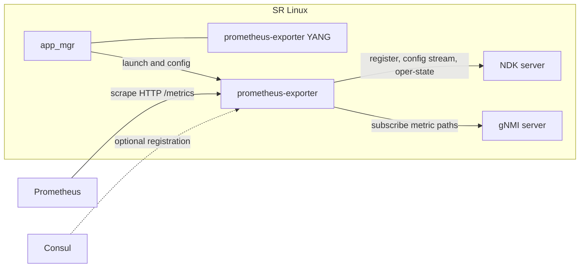

# srl-prometheus-exporter

SR Linux NDK agent that exposes a Prometheus endpoint. It registers with the NDK server through [srl-labs/bond](https://github.com/srl-labs/bond), reads metric state from the gNMI server, and serves the result over HTTP.

Releases live at [srl-labs/srl-prometheus-exporter](https://github.com/srl-labs/srl-prometheus-exporter). Originally created by [Karim Radhouani](https://github.com/karimra/srl-prometheus-exporter).

**0.3.0 is a breaking release.** It does not work with the 0.2.x packages or with SR Linux releases older than the NDK v0.5 API.

- Metric paths target SR Linux 26.7 YANG ([nokia/srlinux-yang-models](https://github.com/nokia/srlinux-yang-models) `v26.7.2`). The old `/acl/ipv4-filter`, `/acl/ipv6-filter`, and `/acl/cpm-filter` paths are gone. Custom metrics that still use them return no data.
- The NDK client is `github.com/srl-labs/bond` v0.3.0, which uses `github.com/nokia/srlinux-ndk-go` v0.5.0. `github.com/karimra/srl-ndk-demo` is no longer used.
- Packages are `.deb` only. Install them with apt. RPM builds are not published.



app_mgr loads the YANG module and the application YAML from the deb. The process talks to the NDK server for its own configuration and operational state, and to the gNMI server for the SRL paths it exports. Prometheus scrapes the HTTP listener. Consul registration is optional.

### Prerequisites

- The grpc-server named by `grpc-server` (default `prometheus-exporter`) is enabled, includes the `gnmi` service, has `unix-socket admin-state enable`, and does not set `socket-filename`. The exporter dials `/opt/srlinux/var/run/sr_grpc_server_<grpc-server>`. YANG validation rejects `admin-state enable` unless the server is enabled, its unix socket is enabled, and `socket-filename` is unset. A missing `gnmi` service shows up as scrape errors
- The configured HTTP address and port are accepted by SRL CPM filters
- bond also opens the configured gRPC server unix socket at startup (`insecure-mgmt` unless changed in bond)

When `app_mgr` is already running, the package postinstall commits this
configuration for you with `sr_cli -ec`, then reloads `app_mgr`: it enables
the NDK server and adds grpc-server `prometheus-exporter` (gnmi service,
unix socket only, no authentication). Any local process that can open that
socket can call gNMI. Uninstall does not remove
either setting; both stay enabled. To install the package without those
commits, set `SRL_PROMETHEUS_EXPORTER_SKIP_CONFIG`:

```bash
sudo SRL_PROMETHEUS_EXPORTER_SKIP_CONFIG=1 apt-get install -y ./srl-prometheus-exporter_0.3.0_Linux_x86_64.deb
```

`scripts/setup-node.sh` runs gnmic in Docker from a host. In one commit it
enables the NDK server and grpc-server `prometheus-exporter`, adds CPM ACL
entry `666` for the exporter port, and binds the `cpm` filters. With
`--consul` it also adds entry `667` for Consul replies and sets the
registration address. `--metric` and `--enable` turn the exporter on. The
containerlab uses the same script. `scripts/cleanup-node.sh` removes entries
`666` and `667` and leaves everything else in place:

```bash
scripts/setup-node.sh --target 192.0.2.10:57400 --metric interfaces --enable
scripts/cleanup-node.sh --target 192.0.2.10:57400
```

`--help` lists the flags. YANG validation rejects `admin-state enable` while
the NDK server or the grpc-server unix socket is missing. Without the setup
helper, enable them from the node CLI:

```bash
sr_cli -ec -- system ndk-server admin-state enable
sr_cli -ec -- system grpc-server prometheus-exporter admin-state enable services [ gnmi ] metadata-authentication false unix-socket admin-state enable
```

### Installation

Copy the `.deb` from the [srl-labs releases](https://github.com/srl-labs/srl-prometheus-exporter/releases) onto the SR Linux node and install it with apt:

```bash
sudo apt-get install -y ./srl-prometheus-exporter_0.3.0_Linux_x86_64.deb
```

That install enables the NDK server and adds the gnmi unix socket. Set
`SRL_PROMETHEUS_EXPORTER_SKIP_CONFIG=1` on the `apt-get` command to skip
both commits. Uninstall leaves them enabled.

The arm64 package is `srl-prometheus-exporter_0.3.0_Linux_arm64.deb`.

[labs/clab/README.md](labs/clab/README.md) has a two-node lab and a Prometheus, Consul, and Grafana stack (`run.sh stack`) that can also scrape a hardware node.

Reload the application manager:

```bash
tools system app-management application app_mgr reload
```

Check that `prometheus-exporter` is running:

```bash
show system application prometheus-exporter
```

### Configuration

```text
--{ + running }--[ system prometheus-exporter ]--
A:srl1# info detail
    address ::
    port 8888
    network-instance mgmt
    http-path /metrics
    admin-state enable
    metric interfaces {
        admin-state enable
    }
```

Predefined metrics and the gNMI paths they subscribe to:

| metric | gNMI paths |
| --- | --- |
| interfaces | `/interface/statistics`, `/interface/ethernet/statistics` |
| subinterfaces | `/interface/subinterface/statistics` |
| lldp | `/system/lldp/interface/statistics` |
| platform | `/platform/control/disk/statistics`, `/platform/control/cpu/software-interrupt`, `/platform/control/memory`, `/platform/linecard/forwarding-complex/buffer-memory` |
| acl | `/acl/policers/system-cpu-policer/statistics`, `/acl/policers/policer/statistics`, `/acl/acl-filter/entry/statistics`, `/acl/interface/input/acl-filter/entry/statistics`, `/acl/interface/output/acl-filter/entry/statistics` |
| aaa | `/system/aaa/server-group/server/statistics` |
| network-instance-bridge-table | `/network-instance/bridge-table/statistics` |
| network-instance-icmp | `/network-instance/icmp/statistics` |
| network-instance-icmp6 | `/network-instance/icmp6/statistics` |
| route-table-ipv4-unicast | `/network-instance/route-table/ipv4-unicast/statistics` |
| route-table-ipv6-unicast | `/network-instance/route-table/ipv6-unicast/statistics` |
| mpls | `/network-instance/route-table/mpls/statistics` |
| isis | `/network-instance/protocols/isis/instance/statistics` |
| bgp | `/network-instance/protocols/bgp/group/statistics` |
| udp | `/network-instance/udp/statistics` |
| tcp | `/network-instance/tcp/statistics` |

Startup paths can be replaced with `/opt/prometheus-exporter/metrics.yaml`.

Custom metrics are configured at runtime:

```text
--{ + candidate shared default }--[ system prometheus-exporter ]--
A:srl1# custom-metric my_metric paths [ /network-instance/protocols/bgp/statistics ]
A:srl1# commit now
```

Flags: `srl-prometheus-exporter --help`.
