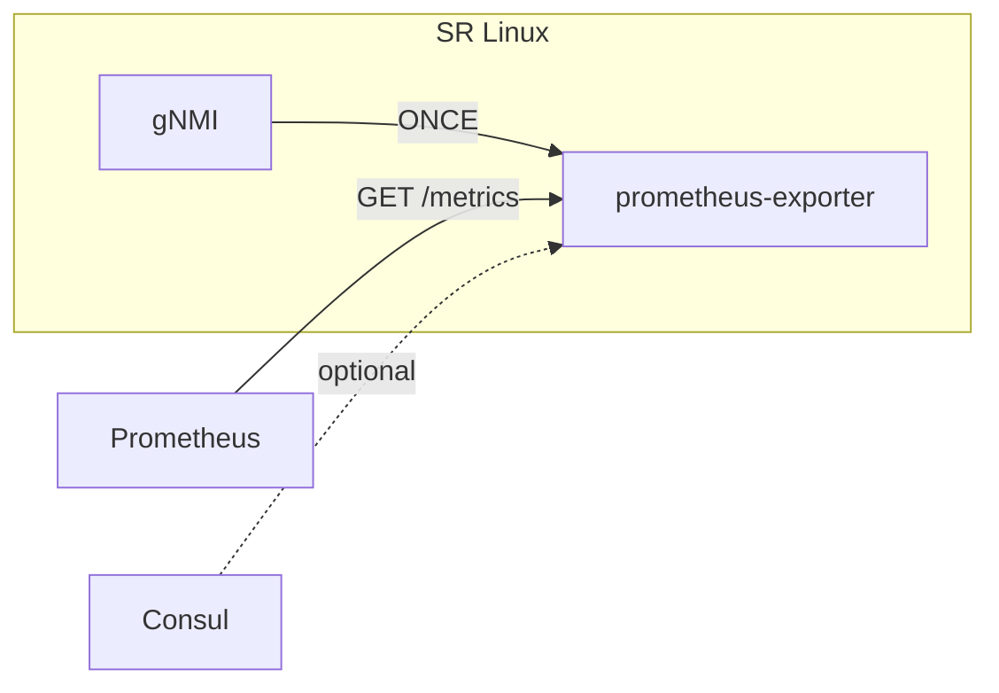
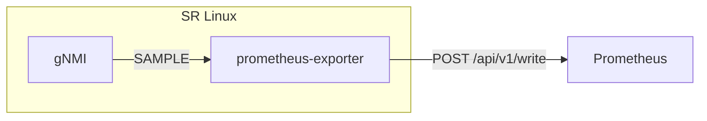

# srl-prometheus-exporter

SR Linux NDK app that exposes gNMI state as Prometheus metrics. It uses the [srl-labs/bond](https://github.com/srl-labs/bond) NDK SDK.

Originally created by [Karim Radhouani](https://github.com/karimra/srl-prometheus-exporter).

Version 0.3.1 targets SR Linux 26.7 and is not compatible with 0.2.x.

`app_mgr` launches the app and delivers its YANG config through the NDK server. The app reads metric state from gNMI. Prometheus can scrape it, or the app can push it.

### Scrape

`scrape admin-state` controls the HTTP listener. The default is enable. Prometheus pulls `/metrics`. Consul registration is optional.



### Remote write

`remote-write` keeps a gNMI `SAMPLE` subscription at `interval` and POSTs each sample to `url`. Set `scrape admin-state disable` when nothing should listen. `tls-profile` is the listener certificate and, when `url` is https, the client certificate and trust anchor.



### Installation

Copy the `.deb` from the [releases](https://github.com/srl-labs/srl-prometheus-exporter/releases) (x86_64 or arm64) onto the node and install it:

```bash
sudo apt-get install -y ./srl-prometheus-exporter_0.3.1_Linux_x86_64.deb
```

The install enables the NDK server and adds grpc-server `prometheus-exporter` with an unauthenticated gNMI unix socket, then reloads `app_mgr`. Any local process can call gNMI on that socket. Uninstall leaves both enabled. To skip these changes:

```bash
sudo SRL_PROMETHEUS_EXPORTER_SKIP_CONFIG=1 apt-get install -y ./srl-prometheus-exporter_0.3.1_Linux_x86_64.deb
```

and configure them yourself:

```bash
sr_cli -ec -- system ndk-server admin-state enable
sr_cli -ec -- system grpc-server prometheus-exporter admin-state enable services [ gnmi ] metadata-authentication false unix-socket admin-state enable
```

The CPM filter must accept the scrape port, and the remote-write port when that is enabled. `scripts/setup-node.sh` applies the socket, ACL, and optional Consul or remote-write config; `scripts/cleanup-node.sh` removes its ACL entries. Run either with `--help` for flags.

```bash
scripts/setup-node.sh --target 192.0.2.10:57400 --metric interfaces --enable
```

[labs/clab](labs/clab/README.md) has a containerlab lab and a Prometheus, Consul, and Grafana telemetry stack for testing.

### Configuration

```text
--{ + running }--[ system prometheus-exporter ]--
A:srl1# info detail
    network-instance mgmt
    admin-state enable
    grpc-server prometheus-exporter
    scrape {
        admin-state enable
        address ::
        port 8888
        http-path /metrics
    }
    debug disable
    metric interfaces {
        admin-state enable
        help-text "SRLinux generated metric"
    }
```

| metric | gNMI paths |
| --- | --- |
| interfaces | `/interface/statistics`, `/interface/ethernet/statistics` |
| subinterfaces | `/interface/subinterface/statistics` |
| lldp | `/system/lldp/interface/statistics` |
| platform | `/platform/control/disk/statistics`, `/platform/control/cpu/software-interrupt`, `/platform/control/memory`, `/platform/linecard/forwarding-complex/buffer-memory` |
| acl | `/acl/policers/system-cpu-policer/statistics`, `/acl/policers/policer/statistics`, `/acl/acl-filter/entry/statistics`, `/acl/interface/input/acl-filter/entry/statistics`, `/acl/interface/output/acl-filter/entry/statistics` |
| aaa | `/system/aaa/server-group/server/statistics` |
| network-instance-bridge-table | `/network-instance/bridge-table/statistics` |
| network-instance-icmp | `/network-instance/icmp/statistics` |
| network-instance-icmp6 | `/network-instance/icmp6/statistics` |
| route-table-ipv4-unicast | `/network-instance/route-table/ipv4-unicast/statistics` |
| route-table-ipv6-unicast | `/network-instance/route-table/ipv6-unicast/statistics` |
| mpls | `/network-instance/route-table/mpls/statistics` |
| isis | `/network-instance/protocols/isis/instance/statistics` |
| bgp | `/network-instance/protocols/bgp/group/statistics` |
| udp | `/network-instance/udp/statistics` |
| tcp | `/network-instance/tcp/statistics` |

Paths can be overridden in `/opt/prometheus-exporter/metrics.yaml`. Custom metrics:

```text
--{ + candidate shared default }--[ system prometheus-exporter ]--
A:srl1# custom-metric my_metric paths [ /network-instance/protocols/bgp/statistics ]
A:srl1# commit now
```
